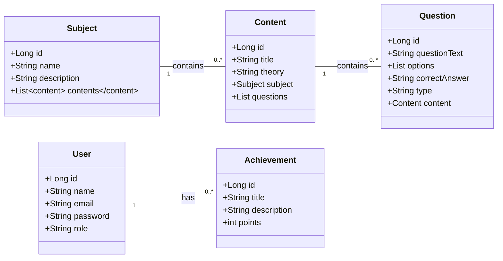

# 📚 MathMaster - Plataforma Gamificada de Aprendizado de Matemática 🚀

## Sumário

1.  [Visão Geral do Projeto](https://www.google.com/search?q=%231-vis%C3%A3o-geral-do-projeto)
2.  [Funcionalidades](https://www.google.com/search?q=%232-funcionalidades)
  - [Frontend (Interface do Usuário)](https://www.google.com/search?q=%23-frontend-interface-do-usu%C3%A1rio)
  - [Backend (API RESTful)](https://www.google.com/search?q=%23%EF%B8%8F-backend-api-restful)
3.  [Stack de Tecnologias](https://www.google.com/search?q=%233-stack-de-tecnologias)
  - [Frontend](https://www.google.com/search?q=%23-frontend)
  - [Backend](https://www.google.com/search?q=%23-backend)
4.  [Arquitetura](https://www.google.com/search?q=%234-arquitetura)
  - [Diagrama de Fluxo de Autenticação (Simplified Sequence Diagram)](https://www.google.com/search?q=%23diagrama-de-fluxo-de-autentica%C3%A7%C3%A3o-simplified-sequence-diagram)
5.  [Estrutura do Projeto](https://www.google.com/search?q=%235-estrutura-do-projeto)
6.  [Como Rodar o Projeto](https://www.google.com/search?q=%236-como-rodar-o-projeto)
  - [Pré-requisitos](https://www.google.com/search?q=%23pr%C3%A9-requisitos)
  - [Configuração do Banco de Dados](https://www.google.com/search?q=%23configura%C3%A7%C3%A3o-do-banco-de-dados)
  - [Configuração das Variáveis de Ambiente](https://www.google.com/search?q=%23configura%C3%A7%C3%A3o-das-vari%C3%A1veis-de-ambiente)
  - [Executando o Backend](https://www.google.com/search?q=%23executando-o-backend)
  - [Executando o Frontend](https://www.google.com/search?q=%23executando-o-frontend)
7.  [Diagramas UML](https://www.google.com/search?q=%237-diagramas-uml)
  - [Diagrama de Classes](https://www.google.com/search?q=%23diagrama-de-classes)
  - [Diagrama de Casos de Uso](https://www.google.com/search?q=%23diagrama-de-casos-de-uso)
8.  [Funcionalidades em Desenvolvimento Futuro](https://www.google.com/search?q=%238-funcionalidades-em-desenvolvimento-futuro)
9.  [Contribuição](https://www.google.com/search?q=%239-contribui%C3%A7%C3%A3o)
10. [Licença](https://www.google.com/search?q=%2310-licen%C3%A7a)
11. [Contato](https://www.google.com/search?q=%2311-contato)

-----

## 1\. Visão Geral do Projeto

O MathMaster é uma plataforma de aprendizado de matemática inovadora, desenvolvida para tornar o estudo mais engajador e eficaz através da gamificação. Nosso objetivo é oferecer uma experiência interativa onde usuários podem aprender diversos tópicos de matemática, resolver exercícios, conquistar medalhas e interagir com uma comunidade vibrante.

Este repositório contém tanto o **Backend** (API) quanto o **Frontend** (Interface do Usuário) do MathMaster.

## 2\. Funcionalidades

### 🌐 Frontend (Interface do Usuário)

* **Autenticação Completa**: Registro, Login e Logout de usuários.
* **Painel Principal (Home)**: Boas-vindas personalizadas, exibição de progresso diário e listagem de matérias e conquistas recentes.
* **Módulos de Estudo (Dashboard)**: Seleção de nível e matérias, com plano de estudos dinâmico e redirecionamento para aulas específicas.
  * **Seleção de Nível**: Permite ao usuário escolher entre níveis Iniciante, Intermediário, Avançado e Especialista com feedback visual.
  * **Seleção de Matérias**: Suporte a seleção múltipla de matérias (Álgebra, Geometria, Cálculo, Estatística).
  * **Plano de Estudos Dinâmico**: Geração automática do plano baseado nas seleções, com tópicos específicos e indicadores visuais de dificuldade.
* **Página de Aulas (Módulo)**: Exibição de conteúdo teórico e exercícios interativos para prática.
  * Teoria e exemplos detalhados para cada tópico.
  * Exercícios de múltipla escolha com feedback instantâneo.
* **Conquistas**: Visualização das conquistas do usuário, progresso e ranking global.
  * Exibe conquistas com diferentes níveis (Bronze, Prata, Ouro, Platina) e progresso em tempo real.
  * Filtros para visualizar conquistas (Todas, Desbloqueadas, Bloqueadas).
  * Timeline interativa para Marcos de Progresso.
  * Ranking dinâmico com abas (Global, Amigos, Semanal).
  * Notificações animadas e som ao desbloquear conquistas.
* **Comunidade**: Permite interações sociais entre usuários.
  * Sistema de abas para discussões, perguntas e desafios.
  * Criação de novos posts com tópicos e interações (curtidas, respostas, salvar).
  * Visualização de perfis de outros usuários com modal detalhado.
  * Eventos da comunidade com detalhes e inscrição.
* **Meu Perfil**: Gerenciamento das informações do usuário.
  * Edição de nome, nome de usuário e biografia.
  * Alteração de foto de perfil e capa.
  * Funcionalidade para alterar senha.
  * Visualização de amigos, seguidores e seguindo.
  * Acesso rápido às conquistas do perfil.
* **Painel Administrativo**: Área restrita para administradores com funcionalidades CRUD (Criar, Ler, Atualizar, Excluir) para gerenciar usuários, matérias, conteúdos, questões e conquistas.
  * Verificação de permissão de `ADMIN` para acesso.
  * Carregamento dinâmico e renderização de tabelas para cada entidade.
  * Modal CRUD genérico para adição e edição.

### ⚙️ Backend (API RESTful)

* **Gerenciamento de Usuários**: Registro, autenticação (JWT), e gestão de perfis (USER/ADMIN).
  * Endpoint para obter o usuário atualmente autenticado (`/api/users/me`).
* **Gestão de Matérias (Subjects)**: CRUD para categorias de estudo (ex: Álgebra, Cálculo).
* **Gestão de Conteúdos (Contents)**: CRUD para o material teórico e aulas dentro de cada matéria, associados às matérias.
  * `EAGER` fetching para os conteúdos de uma matéria, para facilitar a recuperação.
* **Gestão de Questões (Questions)**: CRUD para os exercícios práticos, associados aos conteúdos.
  * `EAGER` fetching para as questões de um conteúdo.
* **Gestão de Conquistas (Achievements)**: CRUD para definir e gerenciar as conquistas do sistema.
* **Autorização Baseada em Papéis**: Proteção de rotas para garantir que apenas administradores acessem funcionalidades sensíveis.
  * Definição de `ADMIN` como primeiro usuário registrado se o banco estiver vazio.
* **Comunicação Stateless**: Utilização de JWT para autenticação escalável e sem estado de sessão no servidor.
* **CORS Configuration**: Configuração para permitir requisições de diferentes origens (frontend).

## 3\. Stack de Tecnologias

### 💻 Frontend

* **HTML5**: Estrutura e semântica das páginas web.
* **CSS3**: Estilização e responsividade da interface.
* **JavaScript (ES6+)**: Lógica de interação, consumo de API e manipulação do DOM.
* **Font Awesome**: Biblioteca de ícones.
* **Google Fonts (Nunito)**: Tipografia.
* **Web Audio API**: Para efeitos sonoros (ex: conquistas).

### ☕ Backend

* **Java 17**: Linguagem de programação principal.
* **Spring Boot 3.x**: Framework para desenvolvimento rápido de APIs REST.
* **Spring Data JPA / Hibernate**: ORM para persistência de dados em banco relacional.
* **Spring Security**: Framework de segurança para autenticação (JWT) e autorização.
* **MySQL Server 8.0+**: Banco de dados relacional.
* **Maven**: Ferramenta de gerenciamento de dependências e construção do projeto.
* **JJWT**: Biblioteca para geração e validação de JSON Web Tokens.

## 4\. Arquitetura

O projeto adota uma arquitetura em camadas para o backend (Controller, Service, Repository, Model) e uma organização modular e por "features" para o frontend, visando a separação de responsabilidades, manutenibilidade e escalabilidade.

**Estrutura de Pacotes do Backend:**

* `config`: Classes de configuração do Spring, como `SecurityConfig`.
* `controller`: Camada de entrada da API, recebe requisições HTTP e chama serviços.
* `dto`: Data Transfer Objects para transferência segura de dados.
* `model`: Entidades JPA que representam tabelas do banco de dados (`User`, `Subject`, `Content`, `Question`, `Achievement`).
* `repository`: Camada de acesso a dados para operações CRUD.
* `service`: Lógica de negócio da aplicação.
* `util`: Classes utilitárias como `JwtUtil` para geração e validação de tokens.

### Diagrama de Fluxo de Autenticação (Simplified Sequence Diagram)

```mermaid
sequenceDiagram
    participant User as Usuário (Frontend)
    participant AuthC as AuthController (Backend)
    participant AuthS as AuthService (Backend)
    participant AuthM as AuthenticationManager (Spring Security)
    participant JpaUDS as JpaUserDetailsService
    participant UserR as UserRepository
    participant JwtU as JwtUtil

    User->>AuthC: POST /api/auth/login (email, password)
    AuthC->>AuthS: loginUser(email, password)
    AuthS->>AuthM: authenticate(UsernamePasswordAuthToken)
    AuthM->>JpaUDS: loadUserByUsername(email)
    JpaUDS->>UserR: findByEmail(email)
    UserR-->>JpaUDS: User object (found)
    JpaUDS-->>AuthM: UserDetails (with role)
    AuthM-->>AuthS: Authentication successful
    AuthS->>AuthS: Set Authentication in SecurityContextHolder
    AuthS->>JwtU: generateToken(UserDetails)
    JwtU-->>AuthS: JWT
    AuthS-->>AuthC: JWT, User object
    AuthC-->>User: AuthResponse (JWT, userId, userName, role)
    User->>User: Stores JWT in localStorage

    User->>+Backend: GET /api/users/me (Authorization: Bearer JWT)
    Backend->>JwtU: Validate Token
    alt Token Válido & Autenticado
        Backend->>Backend: SecurityContextHolder authenticates request
        Backend->>-User: 200 OK (User Data)
    else Token Inválido / Sem Token / Não Autorizado
        Backend->>-User: 401 Unauthorized / 403 Forbidden
    end
```

## 5\. Estrutura do Projeto

```
MathMaster/
├── assets/
│   ├── images/
│   └── leiame/            # Documentação de funcionalidades do frontend
├── components/           # Componentes reutilizáveis do frontend (menu, notificações, tema)
│   ├── menu.js
│   ├── notifications.js
│   └── theme.js
├── css/                  # Estilos CSS para cada página/componente
│   ├── admin.css
│   ├── comunidade.css
│   ├── conquistas.css
│   ├── dashboard.css
│   ├── index.css
│   ├── login.css
│   ├── modulo.css
│   ├── perfil.css
│   ├── privacidade.css
│   └── termos-de-uso.css
├── js/                   # Scripts JavaScript para cada página
│   ├── admin.js
│   ├── api.js            # Módulo de comunicação com a API backend
│   ├── comunidade.js
│   ├── conquistas.js
│   ├── contato.js
│   ├── dashboard.js
│   ├── index.js
│   ├── login.js
│   ├── modulo.js
│   └── perfil.js
├── pages/                # Páginas HTML da aplicação
│   ├── admin.html
│   ├── comunidade.html
│   ├── conquistas.html
│   ├── contato.html
│   ├── dashboard.html
│   ├── index.html
│   ├── login.html
│   ├── modulo.html
│   ├── perfil.html
│   ├── privacidade.html
│   ├── recuperar-senha.html
│   ├── redefinir-senha.html
│   └── termos-de-uso.html
├── mathmaster-backend-2.0 - backup/ # Diretório do Backend (Spring Boot)
│   ├── src/
│   │   ├── main/
│   │   │   ├── java/br/com/mathmaster/backend/
│   │   │   │   ├── config/             # Configurações de segurança, etc.
│   │   │   │   │   └── security/
│   │   │   │   │       ├── JpaUserDetailsService.java
│   │   │   │   │       └── filter/
│   │   │   │   │           └── JwtAuthFilter.java
│   │   │   │   ├── controller/         # Endpoints da API
│   │   │   │   │   ├── AchievementController.java
│   │   │   │   │   ├── AuthController.java
│   │   │   │   │   ├── ContentController.java
│   │   │   │   │   ├── QuestionController.java
│   │   │   │   │   ├── SubjectController.java
│   │   │   │   │   └── UserController.java
│   │   │   │   ├── dto/                # Data Transfer Objects
│   │   │   │   │   ├── AuthResponse.java
│   │   │   │   │   ├── LoginRequest.java
│   │   │   │   │   └── MessageResponse.java
│   │   │   │   ├── model/              # Entidades JPA
│   │   │   │   │   ├── Achievement.java
│   │   │   │   │   ├── Content.java
│   │   │   │   │   ├── Question.java
│   │   │   │   │   ├── Subject.java
│   │   │   │   │   └── User.java
│   │   │   │   ├── repository/         # Interfaces de repositório JPA
│   │   │   │   │   ├── AchievementRepository.java
│   │   │   │   │   ├── ContentRepository.java
│   │   │   │   │   ├── QuestionRepository.java
│   │   │   │   │   ├── SubjectRepository.java
│   │   │   │   │   └── UserRepository.java
│   │   │   │   ├── service/            # Lógica de negócio
│   │   │   │   │   ├── AchievementService.java
│   │   │   │   │   ├── AuthService.java
│   │   │   │   │   ├── ContentService.java
│   │   │   │   │   ├── QuestionService.java
│   │   │   │   │   ├── SubjectService.java
│   │   │   │   │   └── UserService.java
│   │   │   │   └── util/               # Utilitários (ex: JWT)
│   │   │   │       └── JwtUtil.java
│   │   │   └── resources/              # Arquivos de configuração e dados SQL
│   │   │       ├── application.properties
│   │   │       └── data.sql
│   │   └── test/
│   │       └── java/br/com/mathmaster/backend/
│   │           └── TestesegurancaApplicationTests.java
│   ├── .gitignore
│   ├── HELP.md
│   ├── pom.xml                   # Configuração Maven
│   └── README.md
└── README.md                     # Este arquivo
```

## 6\. Como Rodar o Projeto

### Pré-requisitos

Para rodar este projeto, você precisará ter as seguintes ferramentas instaladas:

* Java (JDK) 17 ou superior
* MySQL Server 8.0+
* Git

### Configuração do Banco de Dados

1.  Certifique-se de que seu servidor MySQL está rodando.
2.  Crie um schema (banco de dados) vazio com o nome: `mathmaster_db`.
    ```sql
    CREATE SCHEMA mathmaster_db;
    ```

### Configuração das Variáveis de Ambiente

Antes de iniciar a aplicação backend, você precisa configurar as seguintes **variáveis de ambiente** na sua máquina:

* `MYSQL_PASSWORD`: A senha do seu usuário do MySQL local (geralmente 'root').
* `JWT_SECRET`: Uma chave secreta longa e codificada em Base64 para assinar os tokens. Você pode gerar uma em [https://www.base64encode.org/](https://www.base64encode.org/).
  * *Nota*: No `application.properties`, já há um valor para `jwt.secret`. Certifique-se de que sua variável de ambiente ou o valor no `application.properties` está configurado corretamente.

### Executando o Backend

1.  **Clone o Repositório:**

    ```bash
    git clone [https://github.com/Rodrigogfernandes/MathMaster.git](https://github.com/Rodrigogfernandes/MathMaster.git)
    cd MathMaster/mathmaster-backend-2.0 - backup/
    ```

2.  **Execute a Aplicação:**

  * Abra o projeto em uma IDE como o IntelliJ e importe-o como um projeto Maven.
  * Encontre a classe `BackendApplication.java` e execute-a.
  * A aplicação iniciará na porta `8080` e o `data.sql` populará o banco com dados iniciais (matérias, conquistas e algumas questões).

    **⚠️ ATENÇÃO: Ponto de Observação Importante\!**
    O arquivo `data.sql` é configurado para popular o banco de dados com dados iniciais **apenas na primeira vez** que você roda o projeto.
    **Após a primeira inicialização bem-sucedida, você DEVE fazer o seguinte:**

  1.  **PARE** a aplicação.
  2.  Vá até o arquivo `src/main/resources/data.sql`.
  3.  **APAGUE TODO O CONTEÚDO** deste arquivo, deixando-o em branco.
  4.  Salve o arquivo vazio.
      Se você não fizer isso, a aplicação falhará na próxima inicialização ao tentar inserir dados duplicados (como usuários com o mesmo email). A partir daí, você poderá iniciar e parar o backend quantas vezes quiser sem problemas.

### Executando o Frontend

O frontend é composto por arquivos HTML, CSS e JavaScript estáticos. Para executá-lo, você pode usar qualquer servidor web estático.

1.  Navegue até a raiz do diretório `MathMaster/` no seu terminal.
2.  Você pode usar uma extensão de "Live Server" em IDEs como VS Code, ou iniciar um servidor Python simples:
    ```bash
    # Para Python 3
    python -m http.server 5000
    # Para Python 2
    python -m SimpleHTTPServer 5000
    ```
3.  Após iniciar o servidor, abra seu navegador e acesse `http://localhost:5000/pages/login.html` (ou a porta que você configurou).
  * **Observação**: O `api.js` está configurado para se comunicar com o backend em `http://localhost:8080/api`. Certifique-se de que o backend esteja rodando.

## 7\. Diagramas UML

### Diagrama de Classes



### Diagrama de Casos de Uso

```mermaid
%% Diagrama de Casos de Uso (UML Use Case Diagram)
graph TD
    actor User as "Usuário"
    actor Admin as "Administrador"

    rectangle MathMaster {
        usecase UC1 as "Registrar-se"
        usecase UC2 as "Fazer Login"
        usecase UC3 as "Visualizar Módulos"
        usecase UC4 as "Estudar Módulo"
        usecase UC5 as "Responder Exercício"
        usecase UC6 as "Visualizar Conquistas"
        usecase UC7 as "Participar da Comunidade"
        usecase UC8 as "Visualizar Perfil"
        usecase UC9 as "Editar Perfil"
        usecase UC10 as "Alterar Senha"
        usecase UC11 as "Gerenciar Usuários"
        usecase UC12 as "Gerenciar Matérias"
        usecase UC13 as "Gerenciar Conteúdos"
        usecase UC14 as "Gerenciar Questões"
        usecase UC15 as "Gerenciar Conquistas"
        usecase UC16 as "Fazer Logout"
    }

    User -- UC1
    User -- UC2
    User -- UC3
    User -- UC4
    User -- UC5
    User -- UC6
    User -- UC7
    User -- UC8
    User -- UC9
    User -- UC10
    User -- UC16

    Admin -- UC11
    Admin -- UC12
    Admin -- UC13
    Admin -- UC14
    Admin -- UC15
    Admin -- UC16

    Admin -- UC2
    Admin -- UC3
    Admin -- UC4
    Admin -- UC5
    Admin -- UC6
    Admin -- UC7
    Admin -- UC8
    Admin -- UC9
    Admin -- UC10

    UC2 <. UC1 : extends
    UC4 <. UC5 : includes
    UC9 <. UC10 : includes

    UC11 --|> UC12
    UC11 --|> UC13
    UC11 --|> UC14
    UC11 --|> UC15
```

## 8\. Funcionalidades em Desenvolvimento Futuro

Esta seção detalha as funcionalidades que atualmente são simuladas (mockadas) no frontend ou que possuem apenas um esqueleto básico, e que serão expandidas com suporte completo do backend em futuras iterações do projeto.

* **Lógica de Progresso do Usuário (XP, Moedas, Streak)**: Atualmente, a barra de progresso diário, o contador de moedas e a "streak" (dias seguidos de estudo) são mockados no frontend. O backend precisará de entidades e lógica para armazenar e calcular o XP, o saldo de moedas do usuário, e gerenciar a sequência de estudos e metas diárias.
* **Gerenciamento Dinâmico de Conquistas do Usuário**: Embora as conquistas possam ser listadas do backend, a lógica de "desbloqueio", o progresso em cada conquista individual e a associação de conquistas a usuários específicos ainda é simulada no frontend (`conquistas.js`). O backend precisará de tabelas para `UserAchievement` e lógica para registrar quando um usuário cumpre os critérios para uma conquista, atualizar o progresso dela e conceder recompensas.
* **Marcos de Progresso (Milestones)**: A timeline de marcos é atualmente mockada no frontend (`conquistas.js`). Para um sistema completo, o backend precisaria definir esses marcos e ter a lógica para rastrear e verificar quando o usuário os atingiu.
* **Ranking de Usuários**: Os rankings (global, amigos, semanal) são simulados no frontend (`conquistas.js`). O backend precisaria de consultas e lógica para gerar esses rankings com base nos dados reais de progresso e pontuação dos usuários.
* **Sistema de Mensagens/Chat**: A página de perfil possui um modal de chat que simula o envio e recebimento de mensagens (`perfil.js`). O backend precisaria de serviços, controladores e um banco de dados para gerenciar mensagens em tempo real entre usuários.
* **Funcionalidades de Comunidade Avançadas**: O sistema de posts, comentários, curtidas, e salvar posts na comunidade é atualmente mockado no frontend (`comunidade.js`). O backend precisaria de modelos de dados, repositórios e serviços para gerenciar posts, respostas, usuários (para likes/followers), e tópicos.
* **Edição e Exclusão de Usuários no Painel Administrativo**: Embora o backend já tenha endpoints para listar usuários, a funcionalidade completa de `PUT` (edição) e `DELETE` (exclusão) de usuários por um ADMIN precisa ser implementada nos controladores e serviços correspondentes.
* **Gerenciamento Detalhado de Conteúdos e Questões**: Atualmente, a seleção de matérias no dashboard e a navegação por tópicos na página de módulo ainda utilizam alguns dados mockados ou dependem da estrutura EAGER loading. Uma expansão futura permitiria um controle mais granular e dinâmico de aulas, subtópicos e a complexidade de questões via backend, além de possivelmente associar "tempo estimado" e "dificuldade" a cada conteúdo/questão no modelo de dados.
* **Eventos da Comunidade**: O módulo de eventos na página de comunidade é mockado. Um backend completo gerenciaria a criação, listagem, inscrição e notificação de eventos.
* **Sistema de Recompensas e Economia (Moedas)**: Embora as moedas sejam contadas no frontend, a lógica completa de uma "economia" no jogo, onde moedas são ganhas por atividades e podem ser gastas (por exemplo, em itens, ou para desbloquear conteúdo), necessitará de um suporte robusto no backend.

## 9\. Contribuição

Contribuições são bem-vindas\! Se você deseja contribuir com o MathMaster, por favor, siga os passos abaixo:

1.  Faça um fork do projeto.
2.  Crie uma nova branch (`git checkout -b feature/sua-feature`).
3.  Faça suas alterações e commite-as (`git commit -m 'feat: adiciona nova funcionalidade'`).
4.  Envie suas alterações (`git push origin feature/sua-feature`).
5.  Abra um Pull Request detalhando suas modificações.

## 10\. Licença

Este projeto está licenciado sob a licença MIT. Consulte o arquivo `LICENSE` para mais detalhes.

## 11\. Contato

Este projeto foi desenvolvido por:

* **Rodrigo**
  * Email: rodrigo.guedes.g@gmail.com
  * Telefone: +55 83 999251636
  * Endereço: João Pessoa - PB
* **Jônathas Felipe**
  * Email: jfelipe2742@gmail.com
  * Telefone: +55 83 98690-2116
  * Endereço: João Pessoa - PB

Para dúvidas ou sugestões, entre em contato através dos emails acima ou utilize os canais de contato fornecidos na página:

* **Email Geral**: suporte@mathmaster.com.br
* **Telefone**: (83) 99925-1636 (Seg - Sex: 8:00 - 18:00)
* **Endereço da Empresa**: João Pessoa - PB, Rua Joaquim Nabuco, 123
